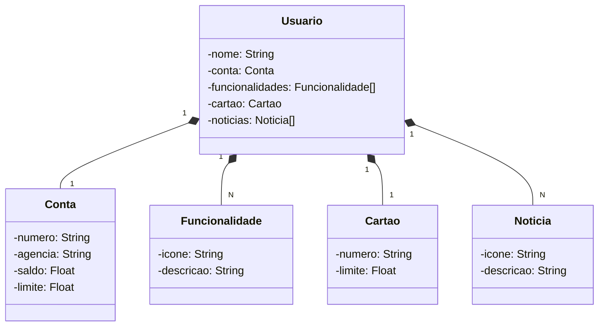

# Desafio Dio - Publicando Sua API REST na Nuvem Usando Spring Boot 3, Java 17 e Railway

## Projeto de Referência:

https://github.com/falvojr/santander-dev-week-2023

## Spring Boot - Bibliotecas utilizadas:

- Spring Web

- Spring Data JPA

- H2 Database

- Postgresql Drive

- Lombok

- Open API (adicionada manualmente)

  

## Melhorias:

- Uso da biblioteca Lombok.

### Bibliotecas do Spring Boot: Uma Abordagem Dissertativa**

O Spring Boot é uma estrutura Java amplamente utilizada para desenvolver aplicativos baseados na Web de forma rápida e eficiente. Ele oferece um conjunto abrangente de bibliotecas que simplificam várias tarefas comuns de desenvolvimento, como gerenciamento de solicitações HTTP, acesso a dados e documentação de API.

Várias bibliotecas essenciais são usadas em conjunto com o Spring Boot para criar aplicativos robustos e escaláveis. Essas bibliotecas incluem:

- **Spring Web:** Esta biblioteca é responsável por processar solicitações HTTP e retornar respostas. Ela fornece um conjunto abrangente de anotações e interfaces que permitem aos desenvolvedores mapear URLs para métodos de manipulador específicos.
- **Spring Data JPA:** Esta biblioteca facilita o acesso a dados relacionais usando o padrão JPA (Java Persistence API). Ela fornece uma abstração sobre a API JDBC subjacente, simplificando o acesso e a manipulação de dados.
- **H2 Database:** Este banco de dados embutido e em memória é ideal para fins de desenvolvimento e teste. Ele não requer instalação ou configuração, o que o torna conveniente para uso em ambientes de desenvolvimento local.
- **Postgresql Drive:** Este driver JDBC permite que os aplicativos se conectem ao banco de dados Postgresql, que é amplamente usado em ambientes de produção. Ele fornece recursos avançados, como suporte a transações e replicação.
- **Lombok:** Esta biblioteca ajuda a reduzir o código clichê, como getters e setters, gerando-os automaticamente com base em anotações. Isso melhora a legibilidade e a manutenção do código.
- **Open API:** Esta biblioteca é usada para gerar documentação de API. Ela fornece uma especificação padronizada que descreve as APIs do aplicativo, tornando mais fácil para os desenvolvedores entenderem e integrarem com elas.

A combinação dessas bibliotecas no Spring Boot oferece uma base sólida para o desenvolvimento de aplicativos Java modernos e escaláveis. Elas simplificam tarefas comuns de desenvolvimento, aprimoram a produtividade e garantem a qualidade e a manutenção do código.

###### 

## Diagrama de Classes:

